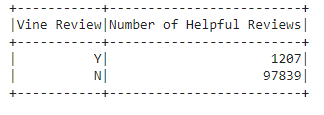
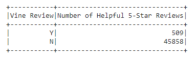
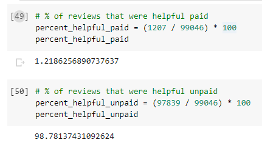
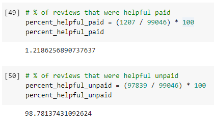

# Amazon Vine Analysis

## Overview of the analysis: Explain the purpose of this analysis.
The purpose of this analysis is to analyze product review data from paid reviewers: Amazon Vine members. This analysis will determine if there is any bias toward favorable reviews from Vine members in the [Kitchen products dataset](https://s3.amazonaws.com/amazon-reviews-pds/tsv/index.txt). Extraction of this data set was done here: [Amazon_Reviews_ETL.ipynb](https://github.com/nguyencao247/Amazon_Vine_Analysis/blob/main/Amazon_Reviews_ETL.ipynb), with the analysis done here: [Vine_Review_Analysis.ipynb](https://github.com/nguyencao247/Amazon_Vine_Analysis/blob/main/Vine_Review_Analysis.ipynb) 

## Results: 
- The following DataFrames were filtered by helpful reviews. Helpful reviews were selected as reviews with over 50% of votes chosen as “helpful.”

- How many Vine reviews and non-Vine reviews were there?
  - The table above and below shows the number of paid (Y for Vine) and unpaid (N for non-Vine) reviews. There were 1,207 vine reviews and 97,839 non-vine reviews. 

- How many Vine reviews were 5 stars? How many non-Vine reviews were 5 stars?
  - There were 509 5-star Vine reviews and 45,858 5-star non-Vine reviews. 

- What percentage of Vine reviews were 5 stars? What percentage of non-Vine reviews were 5 stars?
  - The percentage of 5-star reviews that were Vine was 1.10%  and the percentage that was not Vine was 98.90%. 

## Summary: 
- Almost all (98.90%) of 5-star reviews were from non-Vine reviewers so it does not seem like there was any positivity bias for reviews from the Vine program. 
- Another analysis I would have done is comparing the percent of reviews that were helpful among Vine and non-Vine reviews. Did the customers find Vine reviews more helpful? Were Vine reviewers more detailed than non-Vine reviewers? The following image below shows a very similar analysis as above. Most of the reviews (98.78%) that were helpful were written by non-Vine members. This could be used to conclude that maybe paying for reviews for Vine members may not be as profitable in marketing products.

